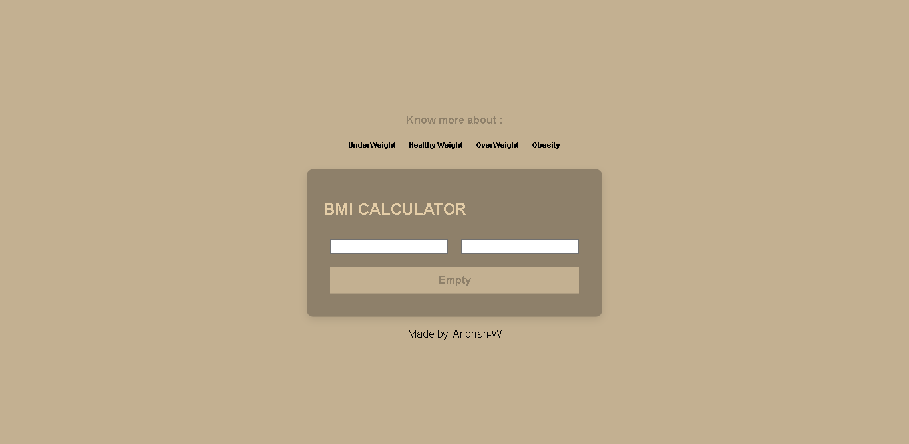

# Bmi Calculator
### Note : CRA(Create React App) version


## What is BMI Calculator?
By Definition BMI is Body mass index (BMI) is a value derived from the mass (weight) and height of a person.
This website made to calculate BMI easier

## Build With
ReactJS,CSS3 and HTML5

## Install
```
git clone https://github.com/Andrian-W/BmiCalculator.git
cd BmiCalculator

```


## Run Website
```
npm run start
```


